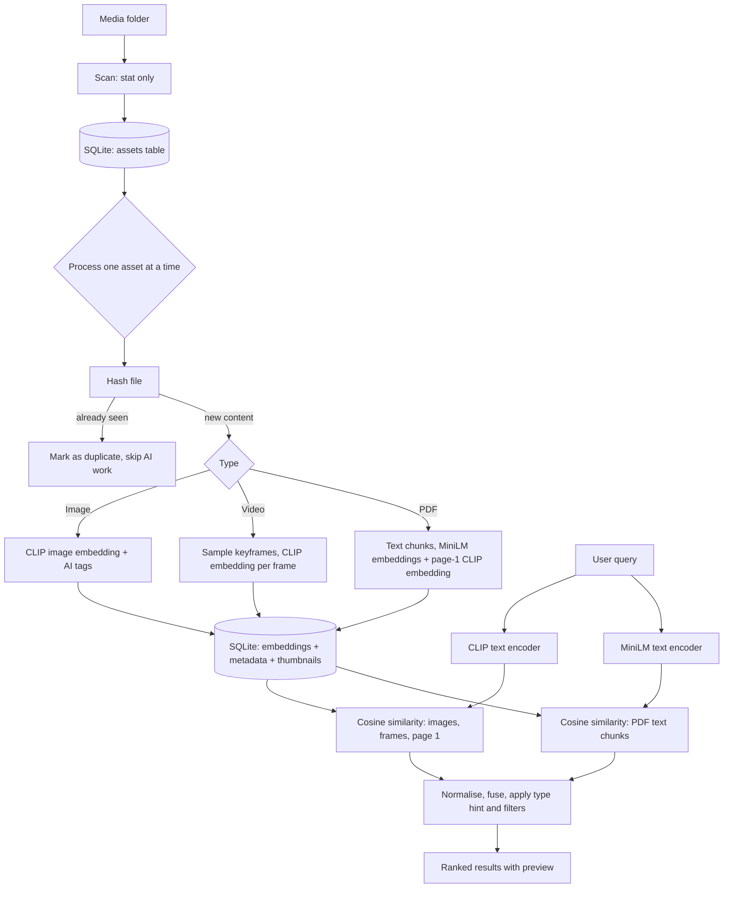

# AI-Powered Digital Asset Manager

> Search your images, videos and PDFs by **what is inside them**, using plain English. Runs fully locally with open-source models. No API keys, no cloud.

    

Organisations keep thousands of media files in folders with unclear names. This project indexes a folder of **images, videos and PDFs**, understands their *content* with AI, and lets users find assets with queries like:

- `a woman sitting on a sofa`
- `Videos containing construction activity`
- `Brochures related to residential projects`
- `apartments with swimming pool and gym` (text found *inside* a PDF)

Search never relies on filenames, folder names or manual tags. It uses the actual content of every asset.

---

## Screenshots

| Search results | Indexing and failure handling |
|---|---|
|  |  |

---

## Features

| Area | What it does |
|---|---|
| **Ingestion** | Scans a local folder recursively and supports JPG, PNG, WebP, BMP, GIF, TIFF, MP4, MOV, AVI, MKV, WebM and PDF |
| **Metadata** | Filename, type, extension, size, path, dimensions, duration, page count, modified time |
| **AI understanding** | CLIP embeddings for images and video frames, sentence embeddings for PDF text, zero-shot AI tags, auto-generated summaries |
| **Semantic search** | Natural-language query, hybrid ranking across modalities, relevance score per result |
| **Video** | Samples keyframes, scores a video by its best frame, and the player **jumps to the matching moment** |
| **PDF** | Matches on text content (shows the matched page and snippet) and on the visual look of page 1 |
| **Filters** | Type, extension, folder, size range, AI tag. Applied before ranking |
| **Preview** | Image viewer, video player, embedded PDF viewer, **Show in folder** and **Copy path** buttons |
| **Progress** | Live progress bar, counters and per-file status in the UI |
| **Reliability** | Resumable, crash-safe indexing, duplicate detection, incremental re-runs, clear handling of corrupt and unsupported files |

---

## Architecture



See [docs/ARCHITECTURE.md](docs/ARCHITECTURE.md) for the full design.

### Key design decisions

| Decision | Choice | Reason |
|---|---|---|
| Image and video model | **CLIP ViT-B/32**, open source, local | One shared text-image space, so natural-language search needs no captioning step and runs on CPU |
| Video strategy | About 1 frame every 4 s (max 16), near-identical frames dropped, video score is its best frame | Cost per video stays bounded however long it is, and the matched timestamp is shown to the user |
| PDF strategy | Text chunks with MiniLM **and** page-1 render with CLIP | Text-heavy documents match on content, visual brochures match on appearance |
| Storage | SQLite with embeddings stored as float32 BLOBs | Persistent, zero infrastructure, easy to inspect |
| Vector search | Exact cosine similarity in NumPy, cached in memory and reloaded when the table changes | Exact results and simple. Swappable for FAISS or pgvector at larger scale |
| Backend | FastAPI | Typed, fast, serves the API and the UI |

---

## Reliability and failure handling

Built for large folders that take hours to process:

- **Checkpointing.** Each asset is its own database transaction. A crash or Ctrl+C loses at most the file in progress, and re-running resumes automatically.
- **Status machine.** `pending → processing → done | failed | duplicate | unsupported`. Anything left `processing` after a crash returns to the queue on restart.
- **Incremental indexing.** Unchanged files (same size and modified time) are skipped, changed files are re-queued, and deleted files are removed together with their embeddings.
- **Duplicate detection.** Content hash (BLAKE2b). The first copy is indexed, later copies are marked as duplicates and shown under the original as "also at", with no AI work and no duplicate results.
- **Corrupt files.** Unreadable images, empty or truncated videos, and broken PDFs fail permanently with a readable reason. They are never retried automatically and can be retried from the UI.
- **Model failures.** Transient errors (memory, inference) are retried with backoff. Infrastructure errors such as a model download failure stop the run without touching the queue.
- **Searchable while indexing.** SQLite runs in WAL mode, so already-indexed files can be searched during a long run.

---

## Quick start

**Requirements:** Python 3.10+. About 600 MB of disk for models (downloaded automatically on first run).

```bash
git clone https://github.com/Riya-sahu29/ai-digital-asset-manager.git
cd ai-digital-asset-manager

python -m venv .venv
# Windows:      .venv\Scripts\activate
# macOS/Linux:  source .venv/bin/activate

pip install -r requirements.txt
cp .env.example .env          # Windows: copy .env.example .env
```

**1. Add media.** Copy your images, videos and PDFs into `media/`. Subfolders are fine. Or download a public dataset:

```bash
# optional: free key from https://www.pexels.com/api/ , set PEXELS_API_KEY in .env
python scripts/fetch_dataset.py --coco 2000 --pexels-photos 15 --pexels-videos 4 --arxiv 6 --commons-pdfs 6 --edge-cases
python scripts/dataset_summary.py
```

**2. Run the app.**

```bash
uvicorn app.main:app --port 8000
```

Open http://127.0.0.1:8000 and click **Index / re-scan folder**. The first run downloads the models, so "loading models" can take a few minutes.

**3. Search.** Type a query and press Enter. Use the filters, click a result to preview it, then use **Show in folder**.

### Command line (for very large folders)

```bash
python -m app.cli index                 # Ctrl+C is safe, re-run to resume
python -m app.cli index --retry-failed
python -m app.cli status
python -m app.cli search "construction site" --type video
```

---

## Configuration

Copy `.env.example` to `.env`. No secrets are required to run the app.

| Variable | Default | Purpose |
|---|---|---|
| `MEDIA_DIR` | `./media` | Folder to index |
| `DATA_DIR` | `./data` | SQLite database and thumbnails |
| `CLIP_MODEL` / `TEXT_MODEL` | `clip-ViT-B-32` / `all-MiniLM-L6-v2` | Embedding models |
| `VIDEO_SECONDS_PER_FRAME` / `VIDEO_MAX_FRAMES` | `4` / `16` | Video sampling |
| `PDF_MAX_PAGES` / `PDF_CHUNK_CHARS` / `PDF_MAX_CHUNKS` | `40` / `800` / `120` | PDF text processing |
| `MAX_ATTEMPTS` | `3` | Retries for transient model errors |
| `MIN_SCORE` | `0.12` | Hide results below this relevance |
| `AUTO_INDEX` | `false` | Start indexing when the server starts |
| `PEXELS_API_KEY` | empty | Only for `scripts/fetch_dataset.py` |

---

## API

| Method | Endpoint | Purpose |
|---|---|---|
| `POST` | `/api/index/start` | Start indexing (`{"retry_failed": true}` re-queues failures) |
| `POST` | `/api/index/stop` | Stop after the current file |
| `GET` | `/api/index/status` | Progress and status counts |
| `GET` | `/api/search?q=...` | Search. Optional `type`, `ext`, `folder`, `tag`, `min_mb`, `max_mb`, `limit` |
| `GET` | `/api/facets` | Values for the filter dropdowns |
| `GET` | `/api/assets?status=failed` | List failed, unsupported or duplicate files |
| `POST` | `/api/assets/{id}/retry` | Re-queue one failed file |
| `GET` | `/api/thumb/{id}` and `/api/file/{id}` | Thumbnail and original file (supports video seeking) |
| `POST` | `/api/reveal/{id}` | Open the file's folder in the OS file manager |
| `GET` | `/api/stats` | Counts and sizes per type |

Interactive API docs: http://127.0.0.1:8000/docs

---

## Search evaluation

I wrote 14 test searches for the dataset and checked each one against the file I expected to see. Full table with the top 3 results per query: [docs/EVALUATION_RESULTS.md](docs/EVALUATION_RESULTS.md).

| Result | Count |
|---|---|
| Expected asset ranked **1st** | 11 of 12 content queries |
| Expected asset ranked 2nd | 1 (`a house in a green field`) |
| Negative query returned nothing confident | Pass (`a spaceship landing on mars`) |
| Known weak case | `Customer testimonial videos` returned a confident false positive |

Honest findings (details in the evaluation doc):
- PDF text scores tend to outrank CLIP image scores, so a brochure can beat a matching photo.
- Abstract concepts with no literal visual (testimonials) are hard for image-embedding search.
- With only a handful of PDFs, unrelated ones still appear at mid scores.

Re-run it yourself: `python eval/run_eval.py`

---

## Dataset

| Type | Real assets | Edge-case files |
|---|---:|---|
| Images | 4 | corrupted image, exact duplicate |
| Videos | 3 | empty video, truncated video |
| PDFs | 3 | truncated PDF |
| Other | - | `.txt` and `.zip` (unsupported) |

**Total: 17 files, about 40 MB** (details in [docs/DATASET_SUMMARY.md](docs/DATASET_SUMMARY.md)).

The brief suggests 5 to 10 GB. This submission uses a much smaller set because of the time limit. The indexer streams one file at a time and checkpoints after each, so a larger collection needs no code changes, only more time. `scripts/fetch_dataset.py` downloads larger public datasets (COCO, Pexels, arXiv, Wikimedia Commons). The full dataset is intentionally not committed.

---

## Testing

```bash
python -m pytest -q tests
```

The pipeline tests use deterministic fake embeddings, so they need no model download. They cover ingestion of all three file types, corrupt and unsupported files, duplicate detection, incremental re-runs, change detection, deletion cleanup and promotion of duplicates, crash recovery, filters, and the API endpoints.

---

## Project structure

```
app/
  main.py          FastAPI endpoints
  indexer.py       scan phase + resumable processing queue
  processors.py    image, video and PDF understanding
  search.py        hybrid semantic ranking and filters
  models.py        CLIP and MiniLM wrappers, zero-shot tagging
  db.py            SQLite schema and connections
  vocab.py         label vocabulary for AI tags
  cli.py           command-line interface
  static/          search UI
scripts/           dataset download and summary
eval/              evaluation queries and runner
tests/             pipeline tests
docs/              architecture, evaluation, dataset summary, limitations
```

---

## Known limitations and production improvements

| Limitation | Next step |
|---|---|
| Small demo dataset | Run on a larger collection with the CLI indexer |
| No OCR, so scanned PDFs match only on page-1 appearance | Add Tesseract or PaddleOCR for pages without text |
| Video audio is ignored | Add Whisper transcripts and embed them like PDF chunks |
| Uniform frame sampling can miss short events | Scene-change detection (PySceneDetect) |
| CLIP is weak at relations, counting and abstract concepts | Re-rank the top results with a vision-language model |
| Exact brute-force vector search | FAISS (HNSW) or pgvector beyond about 1M vectors |
| Score calibration is empirical | Learn fusion weights from labelled queries |
| One worker and no per-file timeout | Process pool with timeouts, batched inference on GPU |
| Only exact duplicates are detected | Perceptual hashing for near-duplicates |

Full list: [docs/KNOWN_LIMITATIONS.md](docs/KNOWN_LIMITATIONS.md)

---

## Author

**Riya**: [GitHub](https://github.com/Riya-sahu29) · [LinkedIn](https://www.linkedin.com/in/riya-priyadarsani-sahu) · [Portfolio](https://riya-sahu29.github.io/Portfolio/)

Built as an assignment for the Full-Stack AI Internship at VANCO.AI. Sample media come from Pexels (free to use) and the PDFs were generated for testing.
